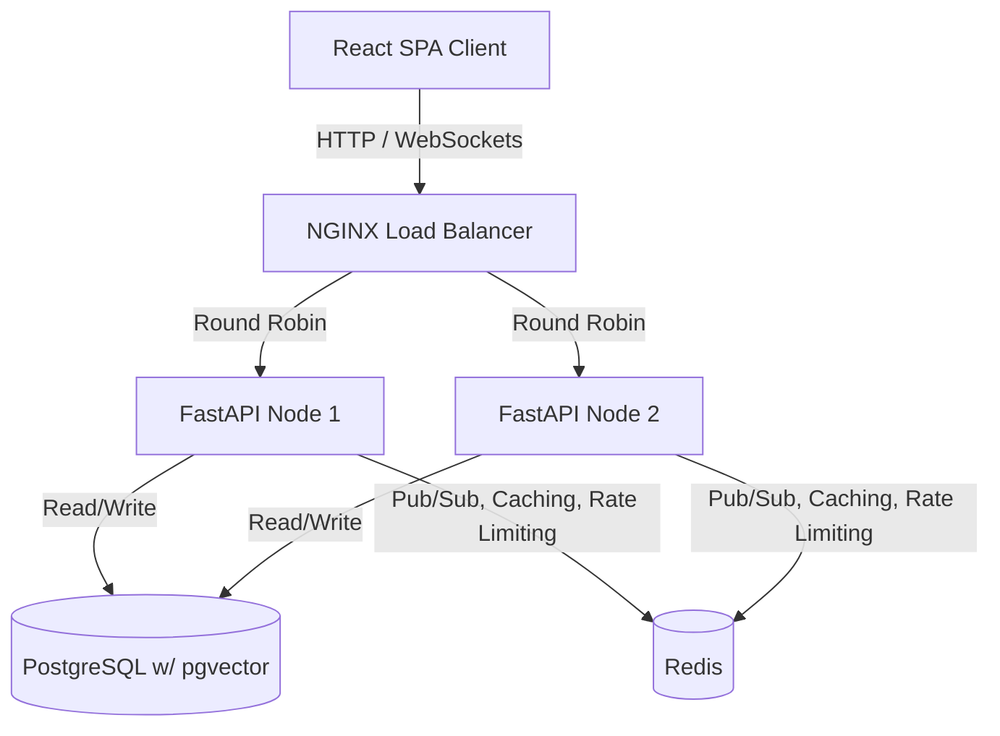

# CollabSpace

CollabSpace is a real-time, collaborative workspace platform with a Google Docs-like collaborative editor, Slack-like real-time chat, and AI-powered features (summarization, semantic search, AI writing assistant).

## Architecture

CollabSpace uses a horizontally scalable architecture, separating the application nodes from state via PostgreSQL and Redis.



## Features
* **Auth**: Secure JWT-based authentication.
* **Real-time Chat**: WebSocket-based messaging with channels and typing indicators.
* **Collaborative Editing**: CRDT-based (Yjs) real-time document editing.
* **AI Integration**: Gemini-powered semantic search (using `pgvector`), document summarization, and a streaming writing assistant.
* **Production-Ready**: Sliding-window rate limiting, Prometheus metrics (`/metrics`), JSON structured logging, and background event processing.

## Setup Instructions

### Local Development (Docker Compose)
This project uses Docker Compose to easily spin up a multi-node backend, NGINX load balancer, PostgreSQL, and Redis locally.

1. Create a `.env` file in the `apps/backend` directory based on `.env.example`. Make sure you provide a valid `GEMINI_API_KEY`.
2. Ensure you have Docker and Docker Compose installed.
3. Run the stack:
   ```bash
   docker-compose up --build
   ```
4. Access the frontend at `http://localhost:5173`.
5. Access the load-balanced API (via NGINX) at `http://localhost:8000`.

### Local Development (Without Docker)
1. Ensure Postgres (with `pgvector`) and Redis are running.
2. Setup backend:
   ```bash
   cd apps/backend
   pip install -e .
   prisma db push
   uvicorn src.main:app --reload
   ```
3. Setup frontend:
   ```bash
   cd apps/frontend
   npm install
   npm run dev
   ```

## Design Decisions and Tradeoffs

### 1. Conflict Resolution (Yjs CRDT vs. Operational Transformation)
**Decision**: Chose Conflict-free Replicated Data Types (CRDTs) using Yjs over Operational Transformation (OT).
**Tradeoff**: 
* **Why CRDT**: It decentralizes conflict resolution. Instead of requiring a single central authority server to transform concurrent operations (OT), CRDTs guarantee eventual consistency mathematically. This reduces server CPU load, simplifies the backend (it only needs to act as a dumb relay/storage for encoded binary updates), and inherently supports P2P setups and offline-first architectures.
* **Tradeoff**: CRDT metadata can grow significantly larger than the actual document size, increasing memory usage and network payload sizes compared to the lean operations in OT.

### 2. Cache Invalidation Strategy
**Decision**: Adopted a Cache-Aside (Lazy Loading) strategy with Explicit Invalidation on Writes.
**Tradeoff**: 
* Cache-aside ensures that only frequently requested data is placed in Redis, avoiding caching stale or rarely accessed data. 
* By performing explicit invalidation on writes (e.g., when a user updates their profile or a document title), we prevent serving stale data. However, there is a tiny window of eventual consistency, and it requires careful discipline in the service layer to ensure every mutating operation invalidates the correct cache keys.

### 3. Rate Limiting Algorithm
**Decision**: Used a Redis-backed Sliding Window Log algorithm.
**Tradeoff**:
* **Why Sliding Window Log**: It provides highly accurate rate limiting without the "boundary effect" (where users can burst double the capacity across a minute boundary) seen in Fixed Window Counters. 
* **Tradeoff**: It stores individual request timestamps in a Redis Sorted Set. This consumes more memory (O(N) per key where N is the number of requests in the window) than Token Bucket or Fixed Window counters, which use O(1) memory. Given the expected traffic, the accuracy benefits outweighed the memory costs.

## Known Limitations & Future Improvements

If I had more time, I would focus on the following production enhancements:

1. **Persistent Redis Storage vs Cluster**: Currently, Redis handles caching, pub-sub, and rate limiting. In a real large-scale deployment, I would split these into separate Redis instances/clusters. Caching should use an LRU eviction policy, while Pub/Sub and Rate Limiting should use non-evicting memory configurations.
2. **OAuth2 Integration**: I would add Social Login (Google, GitHub) via an OAuth2 flow.
3. **Advanced LLM Agents**: While the AI features currently use basic single-shot prompts, implementing an agentic flow (e.g., using LangChain/LangGraph) could allow the AI writing assistant to actively search the workspace history and pull context before generating text.
4. **WebSocket Connection Limits**: Adding a maximum connection cap per user/workspace to prevent abuse and resource exhaustion on a single NGINX node.
