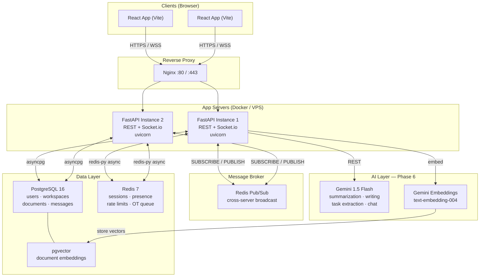

# CollabSpace

> A lightweight **Google Docs + Slack + AI** collaboration platform — built as a portfolio project to showcase backend and system design skills.

---

## Architecture



---

## Tech Stack

| Layer | Technology |
|---|---|
| REST API | FastAPI 0.111+ (Python 3.12) |
| ASGI Server | Uvicorn + Gunicorn |
| Real-time | python-socketio (Socket.io protocol) |
| ORM | Prisma Client Python |
| Database | PostgreSQL 16 + pgvector |
| Cache / Broker | Redis 7 |
| Auth | JWT (`python-jose`) + Google OAuth (`authlib`) |
| AI | Google Gemini API (`google-generativeai`) |
| Frontend | React 18 + Vite 5 (TypeScript) |
| State | Zustand |
| Rich Text Editor | Tiptap |
| Monorepo | npm workspaces |
| Containers | Docker + Docker Compose |

---

## Monorepo Structure

```
collabspace/
├── apps/
│   ├── backend/          ← FastAPI (Python)
│   └── frontend/         ← React + Vite (TypeScript)
├── packages/
│   └── shared/           ← Shared TypeScript types & Socket.io event definitions
└── infra/
    ├── nginx/            ← Reverse proxy config
    └── postgres/         ← DB init scripts (enable pgvector)
```

---

## Build Phases

| Phase | Scope |
|---|---|
| **1** | Auth (email+pass, Google OAuth) · JWT refresh tokens · Workspaces |
| **2** | Socket.io infra · Redis Pub/Sub multi-server broadcast |
| **3** | Document editing · Collaborative text (CRDT) · Optimistic updates |
| **4** | Chat/messaging (Slack-like) · Presence tracking |
| **5** | Notifications · Rate limiting (sliding window) · Response caching |
| **6** | AI: summarization, semantic search, writing assistant, task extraction, AI chat |
| **7** | Observability · Tests · Docker Compose deployment |

### Phase 1: Auth & Workspaces
- JWT authentication with HTTP-only refresh tokens.
- Role-based workspace membership (Owner, Admin, Member).

### Phase 2: Real-time Transport Layer
- WebSockets with JWT query-param authentication.
- Horizontal scaling with **Redis Pub/Sub** broadcasting to multiple Uvicorn instances.

### Phase 3: Collaborative Editing (Google Docs clone)
- Conflict resolution using **CRDTs (Yjs)** rather than Operational Transformation (OT). 
- **Design Choice (CRDT vs OT):** OT requires a complex central server to dictate the total order of operations and mathematically transform concurrent updates. Building an OT engine from scratch is notoriously fragile. CRDTs (like Yjs) guarantee convergence regardless of network timing, meaning the backend can act as a simple "dumb relay" to broadcast binary updates, drastically de-risking the feature.
- **Design Choice (Debounced Saving):** Real-time typing generates dozens of keystrokes per second. Saving every update directly to PostgreSQL would cause severe write amplification and bottleneck the database. Instead, updates are accumulated in memory and flushed to the database every 2 seconds of inactivity, while intermediate state is kept alive via Redis and peer-to-peer websocket propagation.

---

## Getting Started

### Prerequisites
- Docker & Docker Compose
- Node.js ≥ 20
- Python 3.12+

### Local Dev

```bash
# 1. Clone & install
git clone https://github.com/your-username/collabspace.git
cd collabspace
npm install          # installs frontend + shared workspace deps

# 2. Set up environment
cp .env.example .env
# Edit .env with your secrets

# 3. Start infrastructure (Postgres + Redis)
docker-compose up postgres redis -d

# 4. Start backend
cd apps/backend
python -m venv .venv && source .venv/bin/activate   # Windows: .venv\Scripts\activate
pip install -e ".[dev]"
prisma db push
uvicorn src.main:app --reload

# 5. Start frontend (new terminal)
npm run dev:frontend
```

### Full Stack via Docker

```bash
docker-compose up --build
# API:      http://localhost:8000
# Frontend: http://localhost:5173
# Docs:     http://localhost:8000/docs
```
