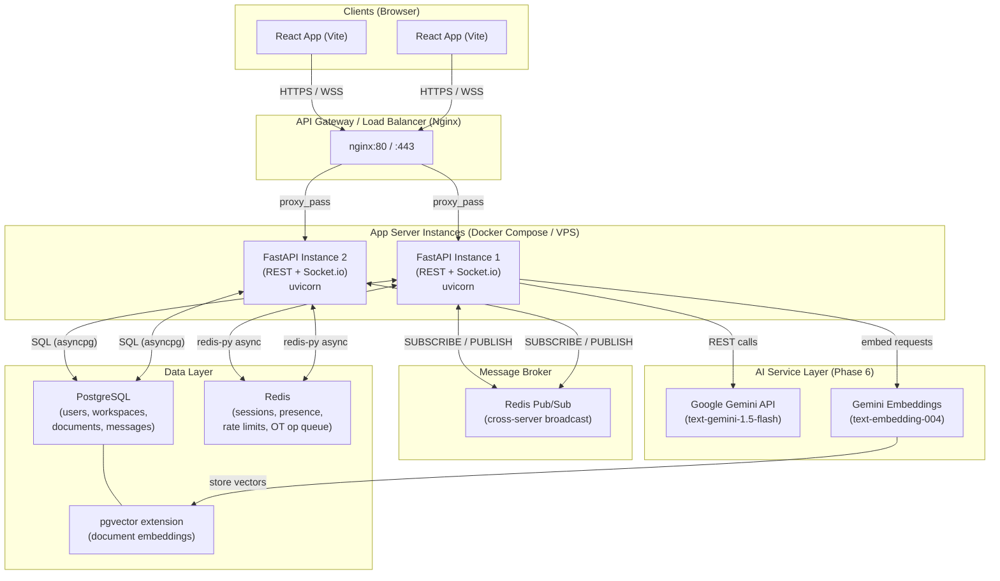

# CollabSpace — Portfolio Project Implementation Plan
> Google Docs + Slack + AI in a single platform, built for SDE placement interviews.

---

## Decisions Summary (from interview)

| Concern | Decision |
|---|---|
| REST API | **FastAPI (Python 3.12)** |
| Real-time | **Socket.io** (via `python-socketio` + `uvicorn`) |
| Message broker | **Redis Pub/Sub** |
| Primary DB | **PostgreSQL** + **Prisma** (via `prisma-client-py`) |
| Cache | **Redis** (sessions, presence, rate limiting) |
| Auth | JWT + refresh tokens · Email/Password + **Google OAuth** |
| Conflict resolution | **Operational Transformation (OT)** |
| Monorepo | **npm workspaces** (`apps/frontend`, `apps/backend` is a Python app, `packages/shared`) |
| Frontend | **React + Vite (TypeScript)** |
| AI Provider | **Google Gemini API** |
| AI Features | Summarization, Semantic Search (pgvector), Writing Assistant, Task Extraction, AI Chat |
| Deployment | **Docker Compose** (local dev → self-hosted VPS) |

---

## Architecture Diagram



---

## Monorepo Folder Structure

```
collabspace/                          ← repo root
├── package.json                      ← npm workspaces root
├── docker-compose.yml                ← Postgres, Redis, backend, frontend, nginx
├── .env.example
├── README.md
│
├── apps/
│   ├── backend/                      ← FastAPI (Python)
│   │   ├── Dockerfile
│   │   ├── pyproject.toml            ← deps: fastapi, uvicorn, python-socketio, prisma, redis, etc.
│   │   ├── prisma/
│   │   │   └── schema.prisma
│   │   └── src/
│   │       ├── main.py               ← app entry, mounts REST + Socket.io
│   │       ├── config.py             ← settings (pydantic BaseSettings)
│   │       ├── database.py           ← asyncpg / prisma client init
│   │       ├── redis_client.py       ← redis-py async init
│   │       │
│   │       ├── auth/                 ← Phase 1
│   │       │   ├── router.py         ← /auth/register, /auth/login, /auth/refresh, /auth/google
│   │       │   ├── service.py
│   │       │   ├── models.py         ← Pydantic schemas
│   │       │   ├── jwt.py            ← token creation, rotation
│   │       │   └── oauth.py          ← Google OAuth2 flow
│   │       │
│   │       ├── workspaces/           ← Phase 1
│   │       │   ├── router.py
│   │       │   ├── service.py
│   │       │   └── models.py
│   │       │
│   │       ├── realtime/             ← Phase 2
│   │       │   ├── socket_server.py  ← python-socketio server, namespace config
│   │       │   ├── pubsub.py         ← Redis pub/sub bridge (publish/subscribe coroutines)
│   │       │   └── events.py         ← typed event definitions
│   │       │
│   │       ├── documents/            ← Phase 3
│   │       │   ├── router.py         ← REST CRUD
│   │       │   ├── service.py
│   │       │   ├── models.py
│   │       │   └── ot/
│   │       │       ├── operations.py ← OT operation types (insert, delete, retain)
│   │       │       ├── transform.py  ← transform(op1, op2) → op1', op2'
│   │       │       └── server.py     ← server-side OT composition & broadcast
│   │       │
│   │       ├── chat/                 ← Phase 4
│   │       │   ├── router.py         ← REST: channels, message history
│   │       │   ├── service.py
│   │       │   ├── models.py
│   │       │   └── presence.py       ← online/offline/typing via Redis
│   │       │
│   │       ├── notifications/        ← Phase 5
│   │       │   ├── router.py
│   │       │   ├── service.py
│   │       │   └── models.py
│   │       │
│   │       ├── ai/                   ← Phase 6
│   │       │   ├── router.py         ← /ai/summarize, /ai/search, /ai/tasks, /ai/assist
│   │       │   ├── service.py        ← orchestration logic
│   │       │   ├── gemini_client.py  ← Gemini API wrapper
│   │       │   ├── embeddings.py     ← embed + store in pgvector
│   │       │   └── search.py         ← semantic search queries
│   │       │
│   │       ├── middleware/           ← Phase 5
│   │       │   ├── rate_limit.py     ← Redis sliding window
│   │       │   └── auth_middleware.py
│   │       │
│   │       └── observability/        ← Phase 7
│   │           ├── logging.py        ← structured JSON logs
│   │           └── metrics.py        ← Prometheus metrics (optional)
│   │
│   └── frontend/                     ← React + Vite (TypeScript)
│       ├── Dockerfile
│       ├── package.json
│       ├── vite.config.ts
│       └── src/
│           ├── main.tsx
│           ├── App.tsx
│           ├── api/                  ← REST client (axios / fetch wrappers)
│           ├── socket/               ← Socket.io client setup, hooks
│           ├── store/                ← Zustand global state
│           ├── features/
│           │   ├── auth/
│           │   ├── workspace/
│           │   ├── editor/           ← OT client, rich-text (Slate.js or Tiptap)
│           │   ├── chat/
│           │   ├── notifications/
│           │   └── ai/
│           ├── components/           ← shared UI primitives
│           └── types/                ← re-exports from packages/shared
│
├── packages/
│   └── shared/                       ← shared TypeScript types (consumed by frontend)
│       ├── package.json
│       └── src/
│           ├── index.ts
│           ├── auth.types.ts
│           ├── document.types.ts
│           ├── chat.types.ts
│           ├── socket.events.ts      ← socket event name constants + payload types
│           └── ot.types.ts           ← OT operation type definitions
│
└── infra/
    ├── nginx/
    │   └── nginx.conf
    └── postgres/
        └── init.sql                  ← enable pgvector extension
```

> **Note on `packages/shared`**: The frontend imports TypeScript types from here. The FastAPI backend defines equivalent Pydantic models — keeping them in sync is a deliberate trade-off of this hybrid stack. An alternative (Phase 7 stretch goal) is to auto-generate OpenAPI types using `openapi-typescript`.

---

## Phased Build Order

### Phase 1 — Auth & User/Workspace Management
**Goal**: Register, log in (email+pass + Google OAuth), issue JWT + refresh tokens, create/join workspaces.

**What you build**:
- Prisma schema: `User`, `Workspace`, `WorkspaceMember`, `RefreshToken`
- `/auth/register`, `/auth/login`, `/auth/refresh`, `/auth/logout`, `/auth/google`
- `/workspaces` CRUD
- JWT middleware (FastAPI `Depends`)
- Redis: store refresh token allowlist / denylist
- Docker Compose: postgres + redis + backend

**Key interview talking points**: Token rotation, refresh token reuse detection, OAuth2 PKCE flow.

---

### Phase 2 — WebSocket Infrastructure + Redis Pub/Sub
**Goal**: Multi-server real-time broadcast; any client on any server instance receives events from any other.

**What you build**:
- `python-socketio` ASGI app mounted on FastAPI
- Authenticated Socket.io handshake (validate JWT on connect)
- Namespace `/doc` (document rooms) and `/chat` (workspace chat)
- Redis Pub/Sub bridge: on message from client → publish to Redis channel → all server instances receive → broadcast to local Socket.io rooms
- Socket event types in `packages/shared/socket.events.ts`

**Key interview talking points**: Fan-out pattern, Redis channel-per-room design, horizontal scaling without sticky sessions.

---

### Phase 3 — Document Editing with OT + Optimistic Updates
**Goal**: Multiple users editing the same document simultaneously, changes reconciled via OT.

**What you build**:
- Prisma schema: `Document`, `DocumentVersion`, `Operation`
- OT engine: `insert`, `delete`, `retain` ops; `transform(op1, op2)` function
- Server: receives op → transforms against pending ops → applies to document → broadcasts transformed op
- Client: optimistic local apply → send op → receive server-transformed op → reconcile
- REST: full document snapshot endpoint for new joiners

**Key interview talking points**: OT composition, commutativity, server as source of truth, revision numbers.

---

### Phase 4 — Chat/Messaging + Presence Tracking
**Goal**: Slack-like channels within a workspace; real-time presence (online/offline/typing).

**What you build**:
- Prisma schema: `Channel`, `Message`, `MessageReaction`
- REST: channel CRUD, paginated message history (cursor-based)
- Socket events: `message:send`, `message:edit`, `message:delete`, `typing:start`, `typing:stop`
- Presence: heartbeat writes `user:{id}:presence` key in Redis with TTL; `/presence` endpoint reads all workspace members

**Key interview talking points**: Cursor pagination vs offset, presence heartbeat design, ephemeral Redis state.

---

### Phase 5 — Notifications + Rate Limiting + Caching Layer
**Goal**: In-app notifications, Redis-backed rate limiting, response caching for heavy read paths.

**What you build**:
- Prisma schema: `Notification`
- Notification fan-out on @mention / doc share / task assignment (via Redis Pub/Sub)
- Redis sliding-window rate limiter middleware (per user, per endpoint)
- Cache: document snapshots, workspace member lists (cache-aside pattern, Redis TTL)

**Key interview talking points**: Sliding window vs token bucket, cache invalidation strategy, notification delivery guarantees.

---

### Phase 6 — AI Features (Google Gemini API)
**Goal**: Integrate all 5 AI features using Gemini + pgvector.

**What you build**:
- `gemini_client.py`: wrapper around `google-generativeai` SDK
- **Summarization**: `POST /ai/summarize` — send doc content to `gemini-1.5-flash`, return summary
- **Semantic search**: embed doc chunks with `text-embedding-004` → store in `pgvector` → cosine similarity search endpoint
- **Writing assistant**: streaming `POST /ai/assist` — inline continuation/rewrite suggestions
- **Task extraction**: `POST /ai/tasks` — structured output (Gemini function calling) → returns task list
- **AI chat**: `POST /ai/chat` — RAG pipeline: retrieve relevant doc chunks → Gemini context window → answer

**Key interview talking points**: RAG architecture, chunking strategy for embeddings, streaming responses (SSE), Gemini function calling for structured output.

---

### Phase 7 — Observability, Tests, Deployment
**Goal**: Production-ready polish; test coverage; Docker Compose deployment.

**What you build**:
- Structured JSON logging (`structlog`)
- Health check endpoint (`/health`, `/ready`)
- Prometheus metrics via `prometheus-fastapi-instrumentator` (optional)
- Unit tests: OT transform logic (pytest)
- Integration tests: auth flows, document API (pytest + httpx)
- Socket.io tests: `python-socketio` test client
- `docker-compose.yml` production profile (nginx, certbot for TLS)
- GitHub Actions CI: lint (ruff) + test + docker build

---

## Proposed Tech Stack (Final)

| Layer | Technology |
|---|---|
| REST API | FastAPI 0.111+ (Python 3.12) |
| ASGI Server | Uvicorn + Gunicorn workers |
| Real-time | python-socketio (Socket.io protocol) |
| ORM | Prisma Client Python (`prisma`) |
| DB | PostgreSQL 16 + pgvector |
| Cache / Broker | Redis 7 (redis-py async) |
| Auth | JWT (`python-jose`) + Google OAuth (`authlib`) |
| AI | Google Gemini API (`google-generativeai`) |
| Frontend | React 18 + Vite 5 (TypeScript) |
| State management | Zustand |
| Rich text editor | Tiptap (extensible, OT-friendly) |
| Monorepo | npm workspaces |
| Containerization | Docker + Docker Compose |
| Linting (Python) | Ruff |
| Testing | pytest + httpx |

---

## Open Questions

> [!IMPORTANT]
> **Rich text editor**: Tiptap (recommended, has collaborative extension built on Yjs but we'll wire our own OT) vs Slate.js (more customizable, bare-metal). Which do you prefer?

> [!NOTE]
> **`packages/shared` language mismatch**: Since the backend is Python and the frontend is TypeScript, shared types live only in the frontend package. Consider adding `openapi-typescript` code-gen in Phase 7 to auto-sync types from FastAPI's OpenAPI schema.

> [!NOTE]
> **Prisma Client Python**: Still maturing — an alternative is `SQLAlchemy 2.0 async` + `Alembic` for migrations (more battle-tested in Python). Worth discussing before Phase 1 starts.

---

## Verification Plan

### After scaffolding (now)
- `docker-compose up` starts postgres + redis with no errors
- `uvicorn src.main:app` returns 200 on `/health`
- `npm run dev` in `apps/frontend` renders a blank Vite/React page

### Per phase
- Each phase ends with a working demo + passing pytest suite before the next begins
